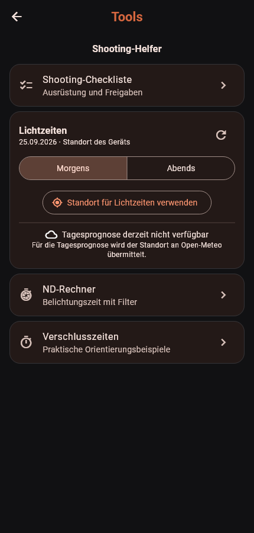

  

<h1 align="center">Release Vault</h1>

<strong>Beta · development build 6.2.2 (Build 90) · no public download yet</strong>

[Deutsch](README.md) | **English**

Release Vault helps photographers create, sign, and manage model and property
releases. Its core features work without an internet connection or an account.
Contacts, contracts, signatures, and PDFs are stored locally in encrypted
form. Only optional online features, such as remote signing, cloud sync, and
weather forecasts, require a connection.

## Features in the current development build

- **Contracts:** Guided model and property releases, reusable contacts,
  custom templates, and bundled sample templates for individual shoots and
  general releases. Completed contracts can be viewed, printed, and shared
  as PDFs.
- **Signing:** Sign on the device or, optionally, through a time-limited
  browser link. Recipients do not need the app or a Release Vault account.
  Returned details are reviewed in the app before finalization.
- **Backup and sync:** Export and restore encrypted backup files on Android
  and Windows. Automatic device sync and cloud backups can use **Nextcloud,
  Google Drive, or Dropbox**. Only one provider can be connected at a time.
  Google Drive uses a visible “Release Vault” folder; Dropbox uses its own app
  folder. Device sync requires the same backup password on every device.
- **Privacy:** Optional app lock, encrypted local storage, and backup
  verification before restoration. Only when Nextcloud synchronization is
  enabled are completed contracts also stored as directly readable PDF copies
  in the user's own Nextcloud folder.
- **Android shooting tools:** Checklist, blue and golden hour with sunrise
  and sunset, daily weather conditions, temperature range and precipitation
  probability, ND calculator, and practical shutter-speed guidelines. Light
  times require location permission; the weather forecast also requires
  internet access.

The interface is available in German and English. Android and the portable
Windows application remain usable without cloud services. An iOS version is
not currently available.

## Project goal

Release Vault grew out of a practical need: As a hobby photographer, I
repeatedly found myself in situations where I needed a model or property
release agreement. After trying several paid solutions, I decided to develop
my own—and, most importantly, **free—solution for hobby photographers**.

I am not a professional software developer, but a user myself. I have therefore
tried to build Release Vault consistently from a user's perspective, making it
as clear, well organized, and easy to use as possible. Despite careful work and
extensive testing, occasional errors may still occur, and I kindly ask for your
understanding. Feedback, suggestions for improvement, and ideas for useful new
features are always very welcome.

## Support and bug fixes

This is a hobby project. Bug reports are welcome, but support and timelines for fixes cannot be guaranteed.

## Download

The next version of Release Vault is in the final stage of development.
Downloads for Android and Windows will be available here again when it is
released. Until then, the Android app's update check remains disabled. Older
test packages should not be treated as a public release.

## App preview

The screenshots show the current beta interface using only fictional records
marked as samples. The Tools image was captured without location permission,
so it does not show calculated light times. Although these screenshots are in
German, the interface can be switched to English in the settings.

| Home screen | People management |
| --- | --- |
|  |  |

| Contracts and drafts | Contract templates |
| --- | --- |
|  |  |

| Android shooting tools |
| --- |
|  |

## Legal information

- [Legal notice and provider information](docs/en/IMPRINT.md)
- [Privacy policy](docs/en/PRIVACY.md)
- [Terms of use](docs/en/TERMS.md)
- [Liability notice](docs/en/LIABILITY.md)
- [Notice regarding contract templates](docs/en/CONTRACT_TEMPLATES.md)
- [License information](docs/en/LICENSES.md)
- [Local storage, encryption, and cloud providers](docs/en/DATA_STORAGE.md)

> **Beta notice:** Release Vault is currently undergoing testing. The included
> contract templates are non-binding samples and do not constitute legal advice.
