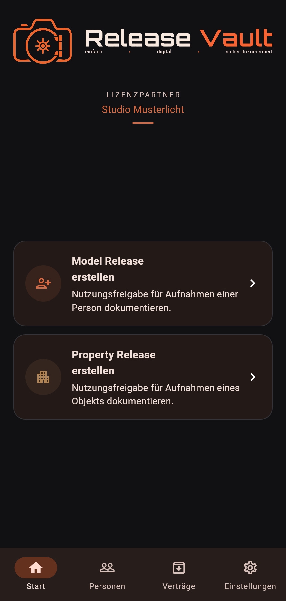
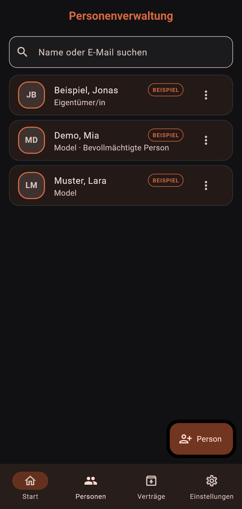
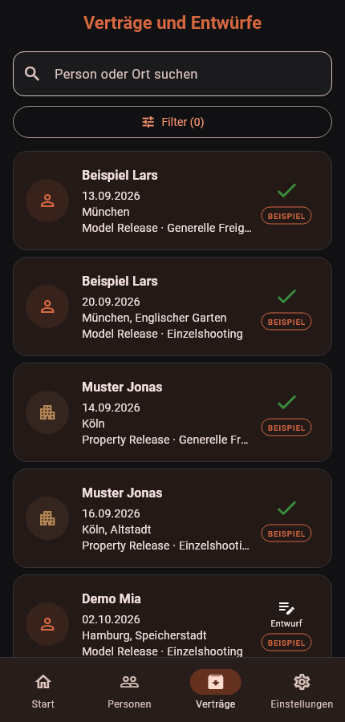
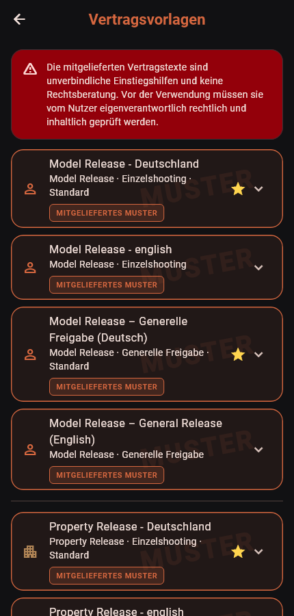

  

<h1 align="center">Release Vault (Beta)</h1>

[Deutsch](README.md) | **English**

Release Vault helps photographers create, sign, and manage model and property
releases digitally.

Contact details, contract templates, signatures, and completed PDF documents
are stored in a structured and encrypted format. The app works fully offline
and requires neither a user account nor a mandatory cloud connection. Encrypted
backups and device data can optionally be synchronized through the user's own
Nextcloud server. Users who prefer not to use a cloud service can save an
encrypted backup file directly from either the Android or Windows application
and restore it on the other platform. This provides a simple way to transfer
data between Android and Windows without using the cloud. An iOS version is
being considered, but is not currently available.

## Project goal

Release Vault grew out of a practical need: As a hobby photographer, I
repeatedly found myself in situations where I needed a model or property
release agreement. After trying several paid solutions, I decided to develop
my own—and, most importantly, **free—solution for hobby photographers**.

I am not a professional software developer, but a user myself. I have therefore
tried to build Release Vault consistently from a user's perspective, making it
as clear, well organized, and easy to use as possible. Despite careful work and
extensive testing, occasional errors may still occur, and I kindly ask for your
understanding. Feedback, suggestions for improvement, and ideas for useful new
features are always very welcome.

## Download

Release Vault is available as an Android app and as a portable Windows
application. Once the respective release checks have been completed, both
versions can be downloaded directly from this page:

- [Download the Android app (APK)](https://github.com/Pit-projects/release-vault-downloads/releases/download/release-vault-beta/Release-Vault-Beta.apk)
- [Download the Windows application (ZIP)](https://github.com/Pit-projects/release-vault-downloads/releases/download/release-vault-beta/Release-Vault-Beta-Windows-portable.zip)

To use the Windows version, extract the ZIP archive and start
`ReleaseVault.exe`. No installation is required.

## App preview

The screenshots show the current beta interface using only fictional records
that are clearly marked as samples. Although the screenshots are shown in
German, the entire app interface can be switched to English in the settings.

| Home screen | People management |
| --- | --- |
|  |  |

| Contracts and drafts | Contract templates |
| --- | --- |
|  |  |

## Legal information

- [Legal notice and provider information](docs/en/IMPRINT.md)
- [Privacy policy](docs/en/PRIVACY.md)
- [Terms of use](docs/en/TERMS.md)
- [Liability notice](docs/en/LIABILITY.md)
- [Notice regarding contract templates](docs/en/CONTRACT_TEMPLATES.md)
- [License information](docs/en/LICENSES.md)
- [Local storage, encryption, and Nextcloud](docs/en/DATA_STORAGE.md)

> **Beta notice:** Release Vault is currently undergoing testing. The included
> contract templates are non-binding samples and do not constitute legal advice.
